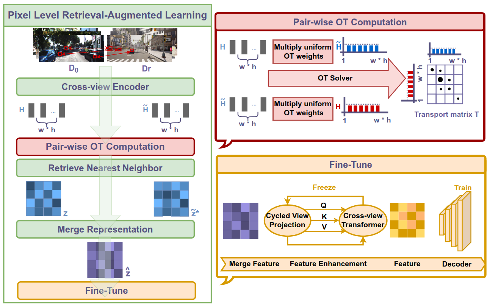
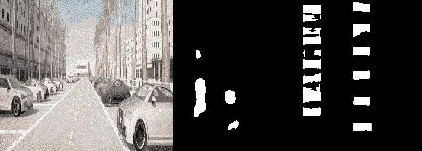
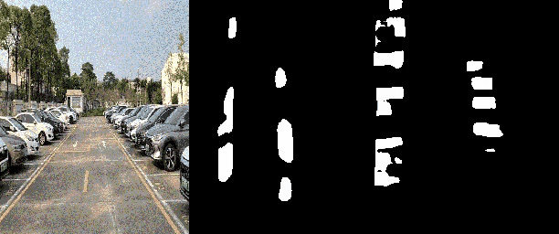

# RALAD: Bridging the Real-to-Sim Domain Gap in Autonomous Driving with Retrieval-Augmented Learn
#### Jiacheng Zuo, Haibo Hu, Zikang Zhou, Yufei Cui, Ziquan Liu, Jianping Wang, Nan Guan, Jin Wang, Chun Jason Xue

## Table of Contents
* [Abstract](#Abstract)
* [Contributions](#Contributions)
* [Dataset](#dataset-download)
* [Getting-Started](#getting-started)
* [Citation](#citation)
* [License](#license)

## Branch Description

* cross-view --> main
* DCNet --> dcnet
* MonoLayout --> monolayout

## Abstract

In the pursuit of robust autonomous driving systems, models trained on real-world datasets often struggle to
adapt to new environments, particularly when confronted with corner cases such as extreme weather conditions. Collecting these corner cases in the real world is non-trivial, which necessitates the use of simulators for validation. However, the high computational cost and the domain gap in data distribution have hindered the seamless transition between real and simulated driving scenarios. To tackle this challenge, we propose Retrieval-Augmented Learning for Autonomous Driving (RALAD), a novel framework designed to bridge the real-to-sim gap at a low cost. RALAD features three
primary designs, including (1) domain adaptation via an
enhanced Optimal Transport (OT) method that accounts for
both individual and grouped image distances, (2) a simple
and unified framework that can be applied to various mod-
els, and (3) efficient fine-tuning techniques that freeze the computationally expensive layers while maintaining robustness. Experimental results demonstrate that RALAD compensates for the performance degradation in simulated environments while maintaining accuracy in real-world scenarios across three different models. Taking Cross View as an example, the mIOU and mAP metrics in real-world scenarios remain stable before
and after RALAD fine-tuning, while in simulated environments, the mIOU and mAP metrics are improved by 10.30% and 12.29%, respectively. Moreover, the re-training cost of our approach is reduced by approximately 88.1%.

## Contributions
* We introduce RALAD, a framework that addresses the real-to-sim gap in autonomous driving and provides pixel-level OT capabilities.
* We apply RALAD to three models, achieving significant performance improvements.
* We establish a mapping between real and simulated environments and conduct extensive experiments to validate the approach.
## ApproachOverview


## Dataset Download
The CARLA dataset can be downloaded [here](https://drive.google.com/drive/folders/1PjSFmhsXkmwXmFhvWXZLsBSPCcIzzVny?dmr=1&ec=wgc-drive-hero-goto)

## Getting-Started
```
python ralad.py --load_weights_folder /path/to/ckpt --split 3Dobject --data_path /path/to/dataset --type dynamic
```
## Pretrained Modelsv

The following table provides links to the [pre-trained models](https://drive.google.com/drive/folders/1PK9yiKdsXmoH53xP-As0h5n0LyBSgTGN?usp=sharing&fileGuid=3X8QJDGGJPXyQgW9) for each dataset mentioned in our paper. The table also shows the corresponding evaluation results for these models.

| Dataset            | Segmentation Objects | mIOU(%) | mAP(%)| Pretrained Model                                                                                                       | 
| :--------:           | :-----:     | :----:   | :----: | :----:                                                                                                                 |
| KITTI 3D Object     | Vehicle    |  38.85  | 51.04 | [link](https://drive.google.com/drive/folders/1XipKf-fLdpikyuQrSjWVrI_TIiZFy7HO?usp=sharing&fileGuid=3X8QJDGGJPXyQgW9) |
| KITTI 3D Object (RALAD)     | Vehicle    |  39.21  | 56.49 | [link](https://drive.google.com/drive/folders/1PjSFmhsXkmwXmFhvWXZLsBSPCcIzzVny?dmr=1&ec=wgc-drive-hero-goto)  |

## Results


## Citation

## License
This project is released under the MIT License (refer to the LICENSE file for details).This project partially depends on the sources of [Monolayout](https://github.com/hbutsuak95/monolayout)